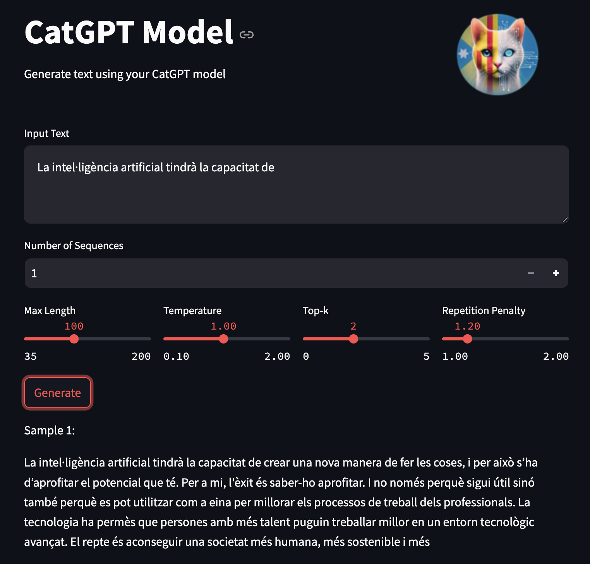
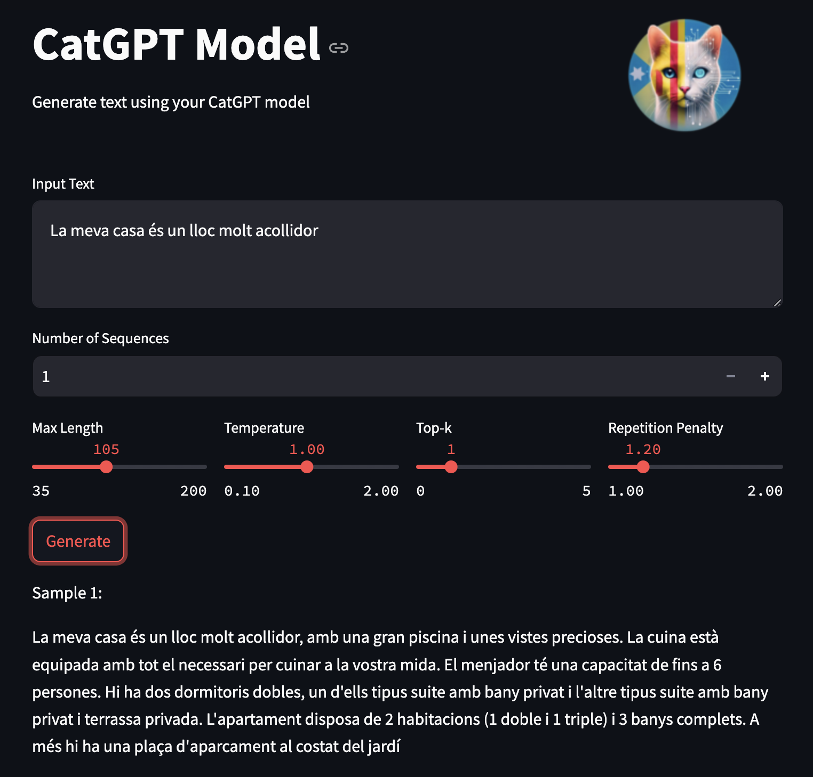

# CatGPT

<div align="center">
  
</div>

## Table of Contents / Taula de Continguts

1. [Project Objective / Objectius del Projecte](#project-objective--objectius-del-projecte)
2. [Model Structure / Estructura del Model](#model-structure--estructura-del-model)
3. [Training Datasets / Datasets d'Entrenament](#training-datasets--datasets-dentrenament)
4. [Tokenizer](#tokenizer)
5. [Document Structure / Estructura dels Documents](#document-structure--estructura-dels-documents)
6. [How to Use the Model / Com Utilitzar el Model](#how-to-use-the-model--com-utilitzar-el-model)
7. [App Structure / Estructura de l'App](#app-structure--estructura-de-lapp)
   - [Overview of Parameters / Visió general dels Paràmetres](#overview-of-parameters--visió-general-dels-paràmetres)
   - [Example Screenshots / Captures de Pantalla d'Exemple](#example-screenshots--captures-de-pantalla-dexemple)
8. [Installation / Instal·lació](#installation--installació)
9. [Contributing / Contribucions](#contributing--contribucions)
10. [License / Llicència](#license--llicència)
11. [Contact Information / Informació de Contacte](#contact-information--informació-de-contacte)

## Project Objective / Objectius del Projecte

**English:**  
CatGPT is a Catalan natural language model created with the goal of providing a lightweight yet effective model that can continue sentences in Catalan. This project is designed to facilitate the generation of coherent and relevant text in Catalan.

**Català:**  
CatGPT és un model de llenguatge natural en català, creat amb l'objectiu de proporcionar un model lleuger però efectiu que pugui continuar oracions en català. Aquest projecte està dissenyat per facilitar la generació de text coherent i rellevant en català.

## Model Structure / Estructura del Model

**English:**  
CatGPT is based on a structure similar to GPT-2, but with approximately 110 million parameters. This reduction in model size allows for faster training and inference while maintaining reasonable text generation quality.

**Català:**  
CatGPT està basat en una estructura similar a GPT-2, però amb aproximadament 110 milions de paràmetres. Aquesta reducció de la mida del model permet un entrenament i una inferència més ràpids, tot i mantenir una qualitat de generació de text raonable.

## Training Datasets / Datasets d'Entrenament

**English:**  
The model has been trained using various datasets, including:

- **Oscar:** A massive multilingual corpus with only Catalan text, which includes:
  - Catalan General Crawling: Obtained from scraping the 500 most popular .cat and .ad domains.
  - Catalan Government Crawling: Data collected from .gencat domains and subdomains of the Catalan government.
  - Existing public corpora: Including DOGC, CaWac, Open Subtitles, the Catalan Wikipedia, among others.
  - Catalan News Agency: News from the Catalan News Agency collected from March 2015 to October 2020.

- **Catalan_Textual Dataset:** A specifically created dataset to cover a wide range of Catalan texts.

Additionally, the model was trained with a total of approximately 3000 million unique tokens and 5460 million tokens (considering different epochs of training with the Oscar dataset).

**Català:**  
El model ha estat entrenat utilitzant diversos datasets, incloent:

- **Oscar:** Un corpus multilingüe massiu amb només text en català, que inclou:
  - Catalan General Crawling: Obtingut a partir de l'scraping dels 500 dominis .cat i .ad més populars.
  - Catalan Government Crawling: Dades recopilades dels dominis .gencat i subdominis del govern català.
  - Corpus públics existents: Incloent DOGC, CaWac, Open Subtitles, la Viquipèdia catalana, entre altres.
  - Catalan News Agency: Notícies de l'Agència Catalana de Notícies recopilades des de març de 2015 fins a octubre de 2020.

- **Catalan_Textual Dataset:** Un conjunt de dades específicament creat per cobrir una àmplia gamma de textos en català.

A més, el model s'ha entrenat amb un total d'uns 3000 milions de tokens únics i 5460 milions de tokens (comptant diferents epochs d'entrenament amb el dataset Oscar).

## Tokenizer

**English:**  
For this project, a specific tokenizer with 32,768 different tokens has been created using the byte pair encoding (BPE) algorithm. This tokenizer was generated using a 50 MB subset of the training data, ensuring adequate coverage of the Catalan vocabulary.

**Català:**  
Per a aquest projecte, s'ha creat un tokenizer específic amb 32,768 tokens diferents utilitzant l'algoritme byte pair encoding (BPE). Aquest tokenizer ha estat generat utilitzant un subset de 50 MB de les dades d'entrenament, assegurant una cobertura adequada del vocabulari català.

## Document Structure / Estructura dels Documents

**English:**  
The following is the structure of the code repository:

```plaintext
├── assets
│   ├── CatGPT_app.py
│   ├── CatGPT_dataset.ipynb
│   ├── CatGPT_model.py
│   ├── CatGPT_run.py
│   ├── CatGPT_train.ipynb
│   └── __pycache__
│       └── CatGPT_model.cpython-310.pyc
├── data
│   ├── CatGPT_dataset.txt
│   ├── catalan_oscar.txt
│   ├── catalan_textual_corpus.txt
│   ├── full_corpus.txt
│   ├── small_catalan_oscar.txt
│   ├── small_corpus.txt
│   └── tiny_corpus.txt
├── images
│   ├── future_AI_example.png
│   └── house_example.png
├── logo
│   ├── CatGPT.jpg
│   └── CatGPT_round.png
├── models
│   ├── CatGPT.pth
│   ├── loss.ipynb
│   └── output.txt
├── requirements.txt
└── tokenizer
    ├── CatGPT_tokenizer.ipynb
    ├── merges.txt
    └── vocab.json
```
## Description of Key Files / Descripció dels Fitxers Principals

1. **CatGPT_tokenizer.ipynb:**  
   - **English:** Contains the code to create and train the tokenizer for the CatGPT model.  
   - **Català:** Conté el codi per crear i entrenar el tokenizer per al model CatGPT.
   
2. **CatGPT_dataset.ipynb:**  
   - **English:** Describes the steps to prepare the dataset used to train the model.  
   - **Català:** Descriu els passos per preparar el dataset utilitzat per entrenar el model.

3. **CatGPT_train.ipynb:**  
   - **English:** Script to train the CatGPT model, including model configuration and hyperparameters.  
   - **Català:** Script per entrenar el model CatGPT, incloent configuració del model i hiperparàmetres.

4. **CatGPT_app.py:**  
   - **English:** Script for the Streamlit app, which provides an interactive interface to generate text using the CatGPT model.  
   - **Català:** Script per a l'aplicació Streamlit, que proporciona una interfície interactiva per generar text utilitzant el model CatGPT.

5. **CatGPT_run.py:**  
   - **English:** Main script to launch the CatGPT app. This script handles the setup and execution of the Streamlit app.  
   - **Català:** Script principal per llançar l'aplicació CatGPT. Aquest script gestiona la configuració i execució de l'aplicació Streamlit.

## How to Use the Model / Com Utilitzar el Model

**English:**  
To use CatGPT, you simply need to clone the repository, install the required libraries, and run the `CatGPT_run.py` script. This script will launch the Streamlit app, where you can interact with the model through an easy-to-use interface.

**Català:**  
Per utilitzar CatGPT, només cal clonar el repositori, instal·lar les biblioteques necessàries i executar el script `CatGPT_run.py`. Aquest script llançarà l'aplicació Streamlit, on podràs interactuar amb el model a través d'una interfície fàcil d'usar.

## App Structure / Estructura de l'App

**English:**  
The visual app provides an intuitive interface to interact with the CatGPT model. Users can input text prompts in Catalan and receive generated text based on the model's predictions. This section covers the app's structure, its parameters, and provides visual examples.

**Català:**  
L'aplicació visual ofereix una interfície intuïtiva per interactuar amb el model CatGPT. Els usuaris poden introduir textos en català i rebre textos generats basats en les prediccions del model. Aquesta secció cobreix l'estructura de l'aplicació, els seus paràmetres i proporciona exemples visuals.

### Overview of Parameters / Visió general dels Paràmetres

**English:**  
In the app, several parameters can be adjusted to fine-tune the model's output:
- **Max Length (tokens):** Defines the maximum number of tokens the model can generate in a single output.
- **Temperature:** Controls the randomness of predictions. Lower values make the model more deterministic.
- **Top-K:** Limits the sampling pool to the top K tokens, focusing on more probable tokens.
- **Repetition Penalty:** Applies a penalty to repeated words or phrases, reducing the likelihood of redundant text in the output.

**Català:**  
A l'aplicació, es poden ajustar diversos paràmetres per afinar la sortida del model:
- **Màxima Longitud (tokens):** Defineix el nombre màxim de tokens que el model pot generar en una única sortida.
- **Temperatura:** Controla l'aleatorietat de les prediccions. Valors més baixos fan que el model sigui més determinista.
- **Top-K:** Limita el conjunt de mostreig als K tokens més probables.
- **Penalització per Repetició:** Aplica una penalització a paraules o frases repetides, reduint la probabilitat de text redundant en la sortida.

### Example Screenshots / Captures de Pantalla d'Exemple

**English:**  
Below are some example screenshots showing the app in action, demonstrating different text prompts and the corresponding generated outputs. The screenshots showcase how the CatGPT model can generate coherent and contextually appropriate text in Catalan. The first example explores a futuristic scenario related to artificial intelligence, while the second example describes a cozy home environment.

**Català:**  
A continuació es mostren algunes captures de pantalla que mostren l'aplicació en acció, demostrant diferents frases d'entrada i les corresponents sortides generades. Les captures de pantalla mostren com el model CatGPT pot generar text coherent i adequat al context en català. El primer exemple explora un escenari futurista relacionat amb la intel·ligència artificial, mentre que el segon exemple descriu un entorn de llar acollidor.

<div align="center">
  
</div>

**English:**  
In this screenshot, the model generates a text continuation related to the future capabilities of artificial intelligence. The output highlights how AI can enhance professional work environments and contribute to a more sustainable and human-centered society.

**Català:**  
En aquesta captura de pantalla, el model genera una continuació del text relacionada amb les capacitats futures de la intel·ligència artificial. La sortida ressalta com la IA pot millorar els entorns de treball professionals i contribuir a una societat més sostenible i centrada en les persones.

<div align="center">
  
</div>

**English:**  
In this screenshot, the model generates a detailed description of a cozy home. The output provides a vivid depiction of the house’s features, including its layout, amenities, and overall atmosphere, demonstrating the model's ability to handle descriptive text generation.

**Català:**  
En aquesta captura de pantalla, el model genera una descripció detallada d'una casa acollidora. La sortida proporciona una descripció vívida de les característiques de la casa, incloent-hi la seva distribució, comoditats i l'ambient general, demostrant la capacitat del model per manejar la generació de textos descriptius.


## Installation / Instal·lació

**English:**  
1. Clone this repository to your local machine:
    ```bash
    git clone https://github.com/yourusername/CatGPT.git
    cd CatGPT
    ```

2. Install the required libraries:
    ```bash
    pip install -r requirements.txt
    ```

3. Run the app:
    ```bash
    python assets/CatGPT_run.py
    ```

**Català:**  
1. Clona aquest repositori a la teva màquina local:
    ```bash
    git clone https://github.com/yourusername/CatGPT.git
    cd CatGPT
    ```

2. Instal·la les biblioteques necessàries:
    ```bash
    pip install -r requirements.txt
    ```

3. Executa l'aplicació:
    ```bash
    python assets/CatGPT_run.py
    ```

## Contributing / Contribucions

**English:**  
We welcome contributions to improve CatGPT. Please submit pull requests or report issues on the GitHub repository.

**Català:**  
Ens agradaria molt comptar amb les vostres contribucions per millorar CatGPT. Envieu sol·licituds d'extracció o informeu de problemes al repositori de GitHub.

## License / Llicència

**English:**  
This project is licensed under the MIT License.

**Català:**  
Aquest projecte està llicenciat sota la Llicència MIT.

## Contact Information / Informació de Contacte

**English:**  
For any inquiries or support, please contact [rogerbaigestrilla@gmail.com].

**Català:**  
Per a qualsevol consulta o suport, contacteu amb [rogerbaigestrilla@gmail.com].
