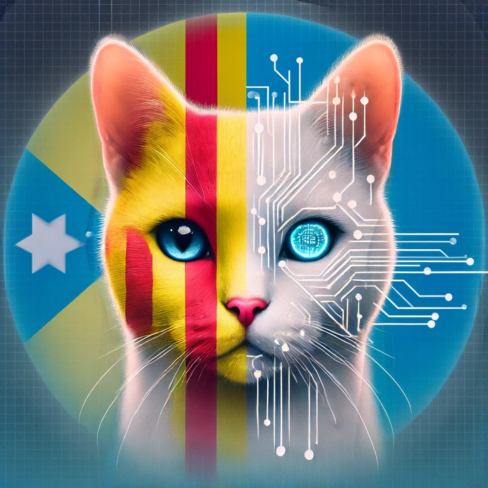

# CatGPT

## Project Objective / Objectius del Projecte

**English:**  
CatGPT is a Catalan natural language model created with the goal of providing a lightweight yet effective model that can continue sentences in Catalan. This project is designed to facilitate the generation of coherent and relevant text in Catalan.

**Català:**  
CatGPT és un model de llenguatge natural en català, creat amb l'objectiu de proporcionar un model lleuger però efectiu que pugui continuar oracions en català. Aquest projecte està dissenyat per facilitar la generació de text coherent i rellevant en català.

## Model Structure / Estructura del Model

**English:**  
CatGPT is based on a structure similar to GPT-2, but with approximately 110 million parameters. This reduction in model size allows for faster training and inference while maintaining reasonable text generation quality.

**Català:**  
CatGPT està basat en una estructura similar a GPT-2, però amb aproximadament 110 milions de paràmetres. Aquesta reducció de la mida del model permet un entrenament i una inferència més ràpids, tot i mantenir una qualitat de generació de text raonable.

## Training Datasets / Datasets d'Entrenament

**English:**  
The model has been trained using various datasets, including:

- **Oscar:** A massive multilingual corpus with only Catalan text, which includes:
  - Catalan General Crawling: Obtained from scraping the 500 most popular .cat and .ad domains.
  - Catalan Government Crawling: Data collected from .gencat domains and subdomains of the Catalan government.
  - Existing public corpora: Including DOGC, CaWac, Open Subtitles, the Catalan Wikipedia, among others.
  - Catalan News Agency: News from the Catalan News Agency collected from March 2015 to October 2020.

- **Catalan_Textual Dataset:** A specifically created dataset to cover a wide range of Catalan texts.

Additionally, the model was trained with a total of approximately 3000 million unique tokens and 5460 million tokens (considering different epochs of training with the Oscar dataset).

**Català:**  
El model ha estat entrenat utilitzant diversos datasets, incloent:

- **Oscar:** Un corpus multilingüe massiu amb només text en català, que inclou:
  - Catalan General Crawling: Obtingut a partir de l'scraping dels 500 dominis .cat i .ad més populars.
  - Catalan Government Crawling: Dades recopilades dels dominis .gencat i subdominis del govern català.
  - Corpus públics existents: Incloent DOGC, CaWac, Open Subtitles, la Viquipèdia catalana, entre altres.
  - Catalan News Agency: Notícies de l'Agència Catalana de Notícies recopilades des de març de 2015 fins a octubre de 2020.

- **Catalan_Textual Dataset:** Un conjunt de dades específicament creat per cobrir una àmplia gamma de textos en català.

A més, el model s'ha entrenat amb un total d'uns 3000 milions de tokens únics i 5460 milions de tokens (comptant diferents epochs d'entrenament amb el dataset Oscar).

## Tokenizer

**English:**  
For this project, a specific tokenizer with 32,768 different tokens has been created. This tokenizer was generated using a 50 MB subset of the training data, ensuring adequate coverage of the Catalan vocabulary.

**Català:**  
Per a aquest projecte, s'ha creat un tokenizer específic amb 32,768 tokens diferents. Aquest tokenizer ha estat generat utilitzant un subset de 50 MB de les dades d'entrenament, assegurant una cobertura adequada del vocabulari català.

## Document Structure / Estructura dels Documents

1. **CatGPT_tokenizer.ipynb:**  
   - **English:** Contains the code to create and train the tokenizer for the CatGPT model.  
   - **Català:** Conté el codi per crear i entrenar el tokenizer per al model CatGPT.
   
2. **CatGPT_dataset.ipynb:**  
   - **English:** Describes the steps to prepare the dataset used to train the model.  
   - **Català:** Descriu els passos per preparar el dataset utilitzat per entrenar el model.

3. **CatGPT_train.py:**  
   - **English:** Script to train the CatGPT model, including model configuration and hyperparameters.  
   - **Català:** Script per entrenar el model CatGPT, incloent configuració del model i hiperparàmetres.

5. **main.ipynb:**  
   - **English:** Examples of using the trained model to generate text from phrases in Catalan.  
   - **Català:** Exemples d'ús del model entrenat per generar text a partir de frases en català.

## How to Use the Model / Com Utilitzar el Model

**English:**  
To use CatGPT, simply clone the repository and execute the cells in the `main.ipynb` file. This file provides examples of how to ask the model to generate text from a phrase and how to customize this generation according to your needs.

**Català:**  
Per utilitzar CatGPT, simplement cal clonar el repositori i executar les cèl·lules del fitxer `main.ipynb`. Aquest fitxer proporciona exemples de com demanar al model que generi text a partir d'una frase i com personalitzar aquesta generació segons les necessitats.
