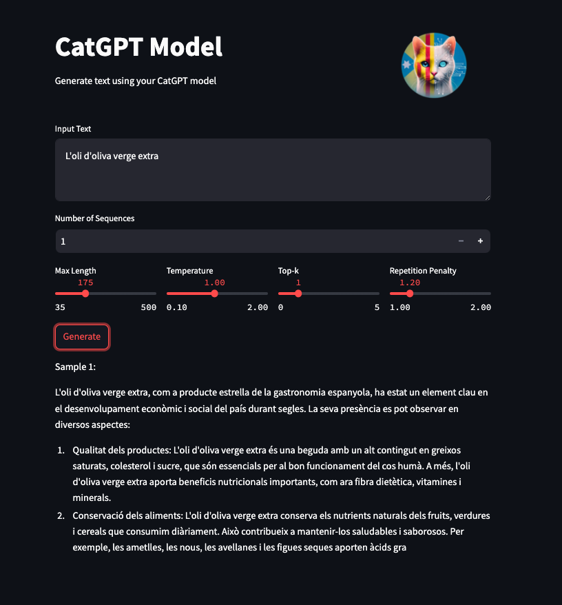
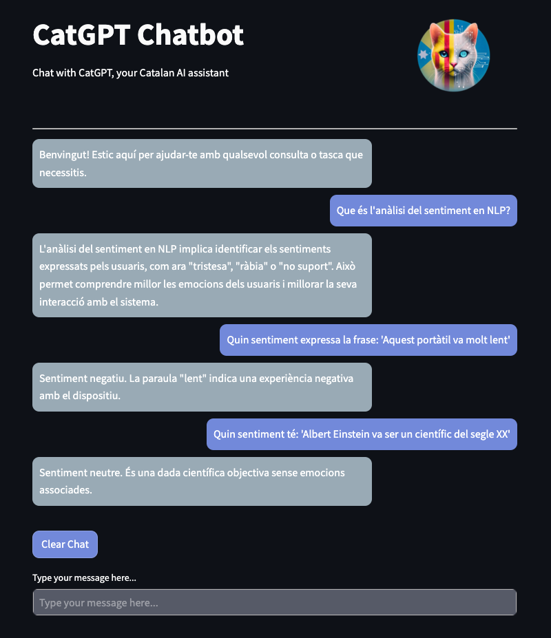
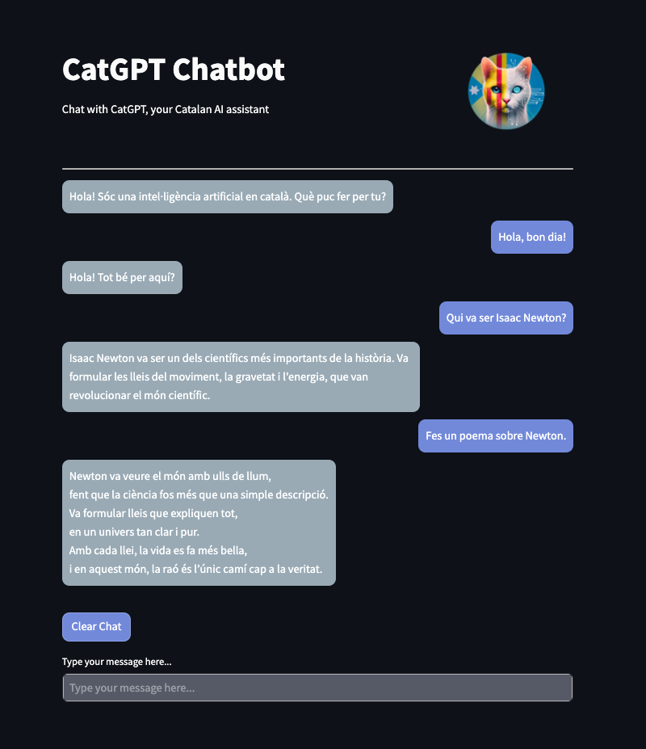

# CatGPT

<div align="center">
  
</div>

## Table of Contents / Taula de Continguts

1. [Project Objective / Objectius del Projecte](#project-objective--objectius-del-projecte)
2. [Model Structure / Estructura del Model](#model-structure--estructura-del-model)
3. [Training Datasets / Datasets d'Entrenament](#training-datasets--datasets-dentrenament)
4. [Tokenizer](#tokenizer)
5. [Document Structure / Estructura dels Documents](#document-structure--estructura-dels-documents)
6. [How to Use the Model / Com Utilitzar el Model](#how-to-use-the-model--com-utilitzar-el-model)
7. [App Structure / Estructura de l'App](#app-structure--estructura-de-lapp)
   - [Overview of Parameters / Visió general dels Paràmetres](#overview-of-parameters--visió-general-dels-paràmetres)
   - [Example Screenshots / Captures de Pantalla d'Exemple](#example-screenshots--captures-de-pantalla-dexemple)
8. [Installation / Instal·lació](#installation--installació)
9. [Contributing / Contribucions](#contributing--contribucions)
10. [License / Llicència](#license--llicència)
11. [Contact Information / Informació de Contacte](#contact-information--informació-de-contacte)

## Project Objective / Objectius del Projecte

**English:**  
CatGPT is a Catalan natural language model created with the goal of providing a lightweight yet effective model that can continue sentences in Catalan. This project is designed to facilitate the generation of coherent and relevant text in Catalan. The model is primarily intended for educational purposes, offering a simple yet functional tool for exploring natural language processing in Catalan. Given its small size, the model does not aim for high performance but rather serves as an accessible resource for learning and experimentation. In addition to predicting the next words, the ultimate goal is to fine-tune the model so it can respond to messages, such as answering questions or following instructions.

**Català:**  
CatGPT és un model de llenguatge natural en català, creat amb l'objectiu de proporcionar un model lleuger però efectiu que pugui continuar oracions en català. Aquest projecte està dissenyat per facilitar la generació de text coherent i rellevant en català. El model està pensat principalment per a usos educatius, oferint una eina senzilla però funcional per explorar el processament del llenguatge natural en català. Atès que la mida del model és reduïda, no té com a objectiu assolir un alt rendiment, sinó servir com a recurs accessible per a l'aprenentatge i l'experimentació. A més de predir les següents paraules, l'objectiu final és crear un model ajustat (finetuned) que pugui respondre a missatges, com ara preguntes o seguir instruccions.

## Model Structure / Estructura del Model

**English:**  
CatGPT is modeled after a structure similar to GPT-2 and features the following key specifications:

- **Parameters:** ~111 million  
- **Vocabulary Size:** 32,768 unique tokens (Catalan-specific)
- **Number of Layers:** 12
- **Attention Heads:** 8
- **Embedding Size:** 768
- **Block Size:** 1024 tokens

The model’s parameter count is primarily influenced by its specialized Catalan vocabulary. Despite being relatively compact, these design choices ensure efficient training and inference, providing satisfactory text generation quality within the Catalan language context.

**Català:**  
CatGPT segueix una estructura similar a GPT-2 i presenta les següents especificacions clau:

- **Paràmetres:** ~111 milions  
- **Mida del Vocabulari:** 32.768 tokens únics (adaptat al català)
- **Nombre de Capes:** 12
- **Capçals d'Atenció:** 8
- **Mida dels Embeddings:** 768
- **Mida del Bloc:** 1024 tokens

El nombre de paràmetres està principalment influenciat pel vocabulari especialitzat en català. Tot i ser relativament compacte, aquestes decisions de disseny asseguren un entrenament i una inferència eficients, oferint una qualitat de generació de text satisfactòria dins del context de la llengua catalana.

## Training Datasets / Datasets d'Entrenament

**English:**  
The model has been trained using various datasets, including:

- **Oscar:** A massive multilingual corpus with only Catalan text, including:
  - Catalan General Crawling: Obtained from scraping the 500 most popular .cat and .ad domains.
  - Catalan Government Crawling: Data collected from .gencat domains and subdomains of the Catalan government.
  - Existing public corpora: Including DOGC, CaWac, Open Subtitles, the Catalan Wikipedia, among others.
  - Catalan News Agency: News from the Catalan News Agency collected from March 2015 to October 2020.

- **Catalan_Textual Dataset:** A specifically created dataset covering a wide range of Catalan texts.

Due to the lack of high-quality Catalan content, we also created the **Patufet collection of datasets** using synthetic data generation, mainly produced with the Gemini Flash model. These datasets include:

  - **Patufet-Textbooks:** The primary dataset with around 300 million tokens, categorized by key sectors such as education, science, history, and culture, with submodels for kids, high school, general, college, and researchers.
  
  - **Patufet-QA (Question-Answering):** This dataset contains around 500k question-answer pairs, based on the Patufet-Textbooks dataset, to support question-answering capabilities.
  
  - **Patufet-PremiumText:** Created using GPT-4o to ensure high-quality content, this dataset contains approximately 6000 examples, including poems, stories, summaries, sentiment analysis, and more.
  
  - **Patufet-Human-Interactions:** Created using GPT-4o, this dataset focuses on quality content related to human interactions, such as greetings and curious questions, with fewer examples.

Other datasets, such as those for programming or instruction-following, were also created. However, these were not included in this version of the model, as they were deemed too advanced and could potentially reduce the model's effectiveness in tasks it could not fully comprehend.

The base model was trained with over 3000 million unique tokens, including the Oscar and Catalan Textual datasets. Once the model had learned the fundamental structure and usage of Catalan, it was further trained with the **Patufet-Textbooks** dataset to ensure a more varied and comprehensive understanding across multiple domains. This additional training greatly improved the model's versatility and depth.

For the instruction-based model, additional training was done using the question-answering and instruction datasets to enable it to respond effectively to messages and follow instructions.

**Català:**  
El model ha estat entrenat utilitzant diversos datasets, incloent:

- **Oscar:** Un corpus multilingüe massiu amb només text en català, que inclou:
  - Catalan General Crawling: Obtingut a partir de l'scraping dels 500 dominis .cat i .ad més populars.
  - Catalan Government Crawling: Dades recopilades dels dominis .gencat i subdominis del govern català.
  - Corpus públics existents: Incloent DOGC, CaWac, Open Subtitles, la Viquipèdia catalana, entre altres.
  - Catalan News Agency: Notícies de l'Agència Catalana de Notícies recopilades des de març de 2015 fins a octubre de 2020.

- **Catalan_Textual Dataset:** Un conjunt de dades específicament creat per cobrir una àmplia gamma de textos en català.

Degut a la manca de contingut de qualitat en català, també es va crear la **col·lecció de datasets Patufet** utilitzant generació de dades sintètiques, principalment amb el model Gemini Flash. Aquests datasets inclouen:

  - **Patufet-Textbooks:** El conjunt de dades principal amb uns 300 milions de tokens, categoritzat per sectors clau com l'educació, la ciència, la història i la cultura, amb submodels per a nens, secundària, general, universitat i investigadors.
  
  - **Patufet-QA (Preguntes i Respostes):** Aquest conjunt de dades conté unes 500k preguntes amb respostes basades en el dataset Patufet-Textbooks, per donar suport a la capacitat de respondre preguntes.
  
  - **Patufet-PremiumText:** Creat utilitzant GPT-4o per garantir contingut de molta qualitat, aquest dataset inclou aproximadament 6000 exemples, com ara poemes, històries, resums, sentiment analysis, i més.
  
  - **Patufet-Human-Interactions:** Creat amb GPT-4o, aquest conjunt de dades es centra en contingut de qualitat relacionat amb interaccions humanes, com salutacions o preguntes curioses, amb pocs exemples.

Altres datasets, com ara els de programació o seguiment d'instruccions, també es van crear. No obstant, no es van incloure en aquesta versió del model, ja que es van considerar massa avançats i podien reduir la capacitat del model en tasques que no comprendria del tot.

El model base es va entrenar amb més de 3000 milions de tokens únics, incloent els datasets Oscar i Catalan Textual. Un cop el model va aprendre l'estructura i ús fonamental del català, es va acabar d'entrenar amb el dataset **Patufet-Textbooks** per assegurar un coneixement molt més variat i complet en diversos àmbits. Aquest entrenament addicional va millorar molt la versatilitat i profunditat del model.

Per al model basat en instruccions, es va entrenar addicionalment amb els datasets de preguntes-respostes i instruccions per tal que pogués respondre eficaçment a missatges i seguir instruccions.

## Tokenizer

**English:**  
For this project, a specific tokenizer with 32,768 different tokens has been created using the byte pair encoding (BPE) algorithm. This tokenizer was generated using a 50 MB subset of the training data, ensuring adequate coverage of the Catalan vocabulary.

**Català:**  
Per a aquest projecte, s'ha creat un tokenizer específic amb 32,768 tokens diferents utilitzant l'algoritme byte pair encoding (BPE). Aquest tokenizer ha estat generat utilitzant un subset de 50 MB de les dades d'entrenament, assegurant una cobertura adequada del vocabulari català.

## Document Structure / Estructura dels Documents

**English:**  
The following is the structure of the code repository:

**Català:**  
La següent és l'estructura del repositori de codi:

```plaintext
├── LICENSE
├── README.md
├── assets
│   ├── CatGPT-IT_app.py
│   ├── CatGPT_app.py
│   ├── CatGPT_dataset.ipynb
│   ├── CatGPT_model.py
│   ├── CatGPT_train.ipynb
│   └── __pycache__
├── images
│   ├── Dialogue_example.png
│   ├── future_AI_example.png
│   └── house_example.png
├── logo
│   ├── CatGPT.jpg
│   └── CatGPT_round.png
├── others
│   ├── IT_model_evaluation.ipynb
│   ├── loss.ipynb
│   ├── model_evaluation.ipynb
│   └── output.txt
├── requirements.txt
├── run
│   ├── CatGPT-IT_run.py
│   └── CatGPT_run.py
└── tokenizer
    ├── CatGPT_tokenizer.ipynb
    ├── merges.txt
    └── vocab.json
```

## Description of Key Files / Descripció dels Fitxers Principals

### CatGPT_tokenizer.ipynb:

- **English:** Contains the code to create and train the tokenizer for the CatGPT model.  
- **Català:** Conté el codi per crear i entrenar el tokenizer per al model CatGPT.

### CatGPT_dataset.ipynb:

- **English:** Describes the steps to prepare the dataset used to train the model.  
- **Català:** Descriu els passos per preparar el dataset utilitzat per entrenar el model.

### CatGPT_train.ipynb:

- **English:** Script to train the CatGPT model, including model configuration and hyperparameters.  
- **Català:** Script per entrenar el model CatGPT, incloent configuració del model i hiperparàmetres.

### CatGPT_app.py:

- **English:** Script for the Streamlit app, which provides an interactive interface to generate text using the CatGPT model.  
- **Català:** Script per a l'aplicació Streamlit, que proporciona una interfície interactiva per generar text utilitzant el model CatGPT.

### CatGPT_run.py:

- **English:** Main script to launch the CatGPT app. This script handles the setup and execution of the Streamlit app.  
- **Català:** Script principal per llançar l'aplicació CatGPT. Aquest script gestiona la configuració i execució de l'aplicació Streamlit.

### CatGPT-IT_app.py / CatGPT-IT_run.py:

- **English:** These scripts correspond to the instruction-tuned version of the model (CatGPT-IT). The `CatGPT-IT_app.py` provides the interactive interface for text generation based on instructions or questions, while `CatGPT-IT_run.py` launches the instruction-based model.  
- **Català:** Aquests scripts corresponen a la versió del model ajustat per a instruccions (CatGPT-IT). El `CatGPT-IT_app.py` proporciona la interfície interactiva per generar text basat en instruccions o preguntes, mentre que `CatGPT-IT_run.py` llança el model basat en instruccions.

### IT_model_evaluation.ipynb:

- **English:** This notebook contains the evaluation metrics and results of the instruction-tuned model (CatGPT-IT).  
- **Català:** Aquest notebook conté les mètriques d'avaluació i els resultats del model ajustat per a instruccions (CatGPT-IT).

### model_evaluation.ipynb:

- **English:** Notebook to evaluate the original version of CatGPT, containing performance metrics and qualitative analyses.  
- **Català:** Notebook per avaluar la versió original de CatGPT, que inclou mètriques de rendiment i anàlisis qualitatives.

### loss.ipynb:

- **English:** A notebook to track and analyze the loss during the training process.  
- **Català:** Un notebook per fer el seguiment i analitzar la pèrdua durant el procés d'entrenament.

### output.txt:

- **English:** This file contains logs or output data from model evaluations.  
- **Català:** Aquest fitxer conté els registres o dades de sortida de les avaluacions del model.

### requirements.txt:

- **English:** Lists the dependencies and libraries required to run the project.  
- **Català:** Llista les dependències i llibreries necessàries per executar el projecte.

### vocab.json / merges.txt:

- **English:** These files are part of the tokenizer for the CatGPT model, containing the vocabulary and the merge rules for subword tokenization.  
- **Català:** Aquests fitxers formen part del tokenizer per al model CatGPT, contenint el vocabulari i les regles de fusió per a la tokenització de subparaules.

## How to Use the Model / Com Utilitzar el Model

**English:**  
To use CatGPT, you simply need to clone the repository, install the required libraries, and run the `CatGPT_run.py` or the `CatGPT-IT_run.py` script depending on the model you want to use. This script will launch the Streamlit app, where you can interact with the model through an easy-to-use interface.

**Català:**  
Per utilitzar CatGPT, només cal clonar el repositori, instal·lar les biblioteques necessàries i executar l'script `CatGPT_run.py` o `CatGPT-IT_run.py`depenent del model a utilizar. Aquest script llançarà l'aplicació Streamlit, on podràs interactuar amb el model a través d'una interfície fàcil d'usar.

## App Structure / Estructura de l'App

**English:**  
The visual app provides an intuitive interface to interact with the CatGPT model. Users can input text prompts in Catalan and receive generated text based on the model's predictions. This section covers the app's structure, its parameters, and provides visual examples.

**Català:**  
L'aplicació visual ofereix una interfície intuïtiva per interactuar amb el model CatGPT. Els usuaris poden introduir textos en català i rebre textos generats basats en les prediccions del model. Aquesta secció cobreix l'estructura de l'aplicació, els seus paràmetres i proporciona exemples visuals.

### Overview of Parameters / Visió general dels Paràmetres

**English:**  
In the app, several parameters can be adjusted to fine-tune the model's output:
- **Max Length (tokens):** Defines the maximum number of tokens the model can generate in a single output.
- **Temperature:** Controls the randomness of predictions. Lower values make the model more deterministic.
- **Top-K:** Limits the sampling pool to the top K tokens, focusing on more probable tokens.
- **Repetition Penalty:** Applies a penalty to repeated words or phrases, reducing the likelihood of redundant text in the output.

**Català:**  
A l'aplicació, es poden ajustar diversos paràmetres per afinar la sortida del model:
- **Màxima Longitud (tokens):** Defineix el nombre màxim de tokens que el model pot generar en una única sortida.
- **Temperatura:** Controla l'aleatorietat de les prediccions. Valors més baixos fan que el model sigui més determinista.
- **Top-K:** Limita el conjunt de mostreig als K tokens més probables.
- **Penalització per Repetició:** Aplica una penalització a paraules o frases repetides, reduint la probabilitat de text redundant en la sortida.

### Example Screenshots / Captures de Pantalla d'Exemple

**English:**  
The screenshots below demonstrate how the CatGPT model performs across different tasks, showcasing both the base text generation model and the instruction-based model. The examples highlight the model's coherence, contextual awareness, and ability to generate natural Catalan text in diverse scenarios. The first example demonstrates the base model’s ability to complete a text about olive oil, while the other two examples show how the instruction-based model handles specific queries and tasks in NLP.

**Català:**  
A continuació, es mostren exemples que demostren el rendiment del model CatGPT en diferents tasques, mostrant tant el model base de generació de text com el model basat en instruccions. Els exemples il·lustren la coherència, la consciència contextual i la capacitat del model per generar text natural en català en diversos escenaris. El primer exemple demostra la capacitat del model base per completar un text sobre oli d’oliva, mentre que els altres dos exemples mostren com el model basat en instruccions maneja consultes específiques i tasques en PLN.

---

<div align="center">
  
</div>

**English:**  
In this screenshot, the base model is prompted to generate text about extra virgin olive oil. The result illustrates the model’s ability to provide a coherent, informative continuation, emphasizing both the nutritional benefits of the product and its cultural significance in Spain. The output is particularly notable for its fluency and knowledge of domain-specific topics.

**Català:**  
En aquesta captura de pantalla, el model base rep com a entrada un text sobre l'oli d'oliva verge extra. El resultat il·lustra la capacitat del model per oferir una continuació coherent i informativa, ressaltant tant els beneficis nutricionals del producte com la seva importància cultural a Espanya. La sortida destaca per la seva fluïdesa i el coneixement de temes específics del domini.

---

<div align="center">
  
</div>

**English:**  
This screenshot demonstrates the instruction-based model’s ability to perform sentiment analysis. The model accurately identifies the sentiment in various sentences, providing clear, contextually appropriate responses in Catalan. This example showcases the model’s skill in natural language understanding tasks and its effective handling of user queries.

**Català:**  
Aquesta captura de pantalla demostra la capacitat del model basat en instruccions per realitzar anàlisis de sentiments. El model identifica amb precisió el sentiment en diverses frases, oferint respostes clares i adequades al context en català. Aquest exemple mostra l’habilitat del model en tasques de comprensió del llenguatge natural i la seva eficàcia en gestionar consultes d’usuaris.

---

<div align="center">
  
</div>

**English:**  
In this final example, the instruction-based model generates a creative response, specifically a poem about Isaac Newton. The output demonstrates the model’s ability to generate rich, descriptive, and imaginative content in Catalan, illustrating how it can be used for more open-ended and creative text generation tasks.

**Català:**  
En aquest darrer exemple, el model basat en instruccions genera una resposta creativa, concretament un poema sobre Isaac Newton. La sortida demostra la capacitat del model per generar contingut ric, descriptiu i imaginatiu en català, il·lustrant com pot utilitzar-se per a tasques de generació de text més obertes i creatives.

---


## Installation / Instal·lació

**English:**  
1. Clone this repository to your local machine:
    ```bash
    git clone https://github.com/yourusername/CatGPT.git
    cd CatGPT
    ```

2. Install the required libraries:
    ```bash
    pip install -r requirements.txt
    ```

3. Run the app:
    ```bash
    python run/CatGPT_run.py
    ```

   ```bash
   python run/CatGPT-IT_run.py
    ```

**Català:**  

1. Clona aquest repositori a la teva màquina local:
    ```bash
    git clone https://github.com/yourusername/CatGPT.git
    cd CatGPT
    ```

2. Instal·la les biblioteques necessàries:
    ```bash
    pip install -r requirements.txt
    ```

3. Executa l'aplicació:
    ```bash
    python run/CatGPT_run.py
    ```
   ```bash
   python run/CatGPT-IT_run.py
    ```

## Contributing / Contribucions

**English:**  
We welcome contributions to improve CatGPT. Please submit pull requests or report issues on the GitHub repository.

**Català:**  
Ens agradaria molt comptar amb les vostres contribucions per millorar CatGPT. Envieu sol·licituds d'extracció o informeu de problemes al repositori de GitHub.

## License / Llicència

**English:**  
This project is licensed under the MIT License.

**Català:**  
Aquest projecte està llicenciat sota la Llicència MIT.

## Contact Information / Informació de Contacte

**English:**  
For any inquiries or support, please contact [rogerbaigestrilla@gmail.com].

**Català:**  
Per a qualsevol consulta o suport, contacteu amb [rogerbaigestrilla@gmail.com].
